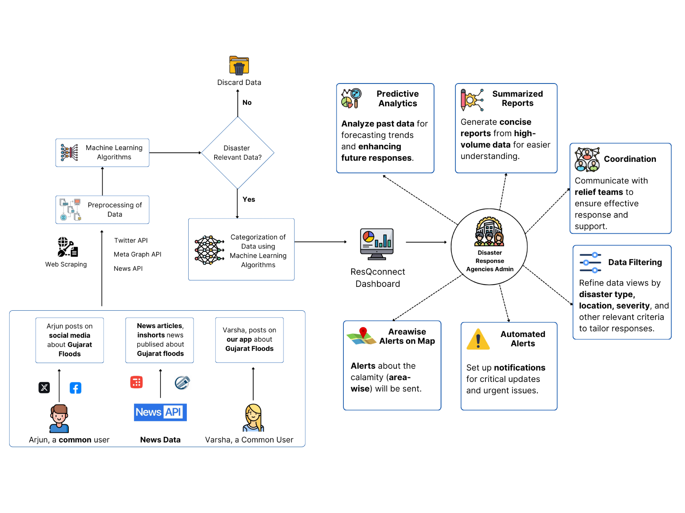
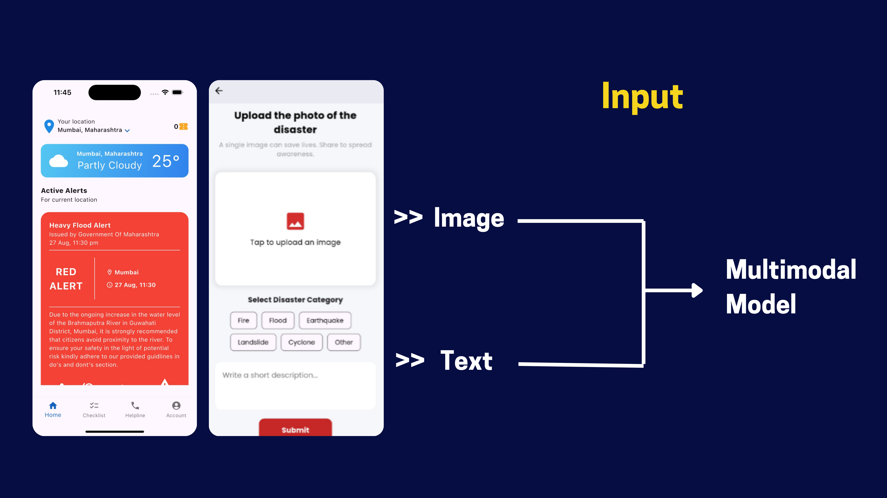
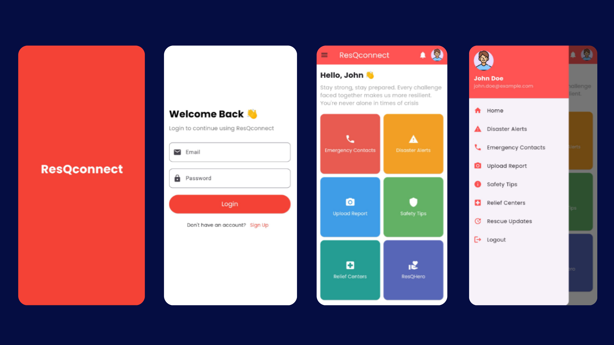
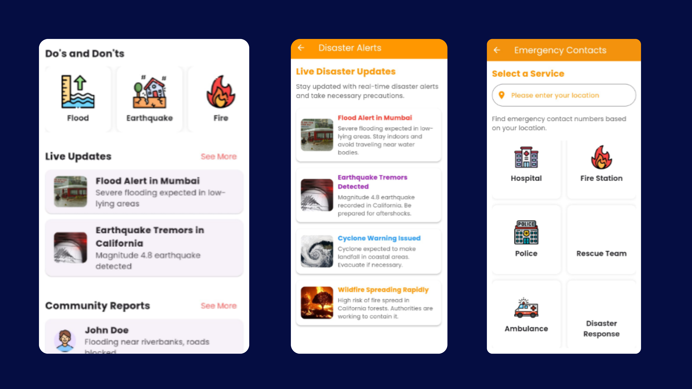
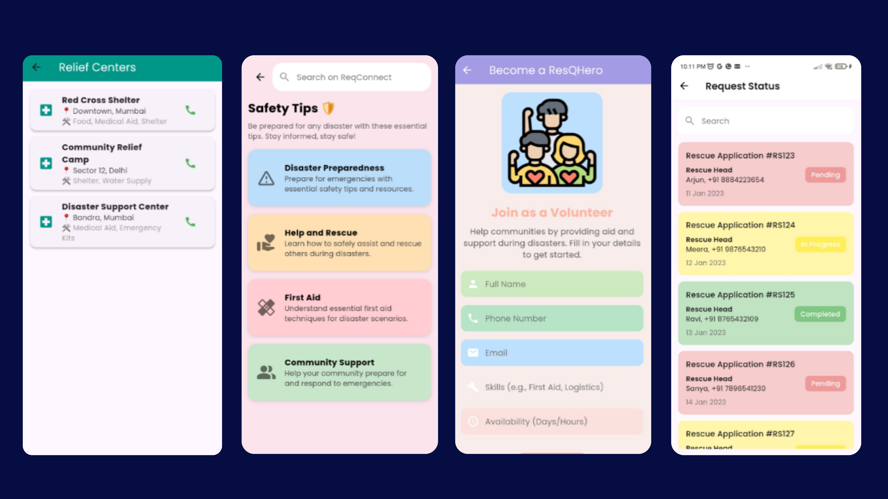
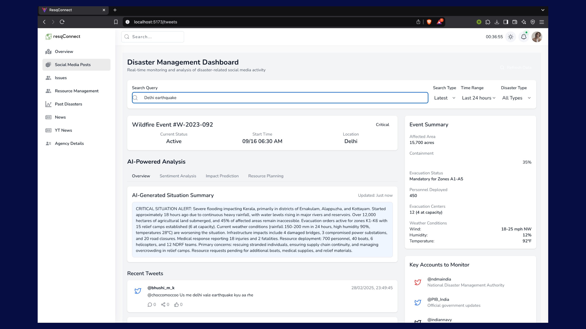
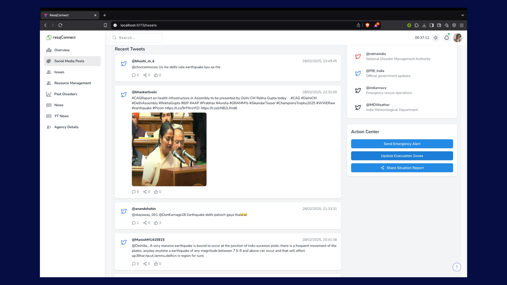
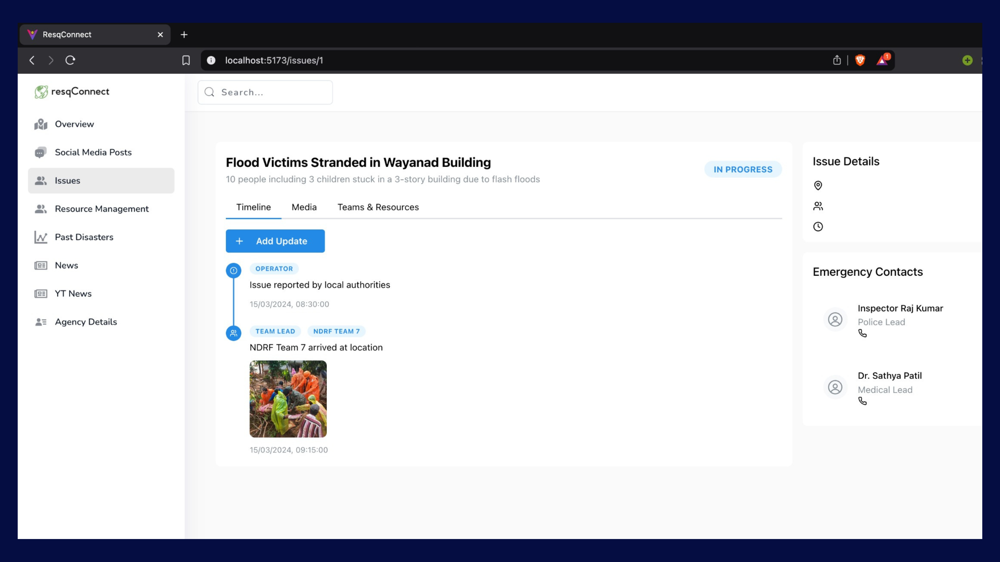

# Resqconnect: AI-Driven Real-time Disaster Related Information Aggregation System


ResQconnect is an AI-powered real-time disaster information aggregation platform designed for real-time situational awareness. The **mobile app** is built for everyday users, letting them access live disaster updates, analytics, and AI-generated summaries in their preferred language—making it easy to grasp local news, social media, and sentiment even in multilingual regions. Users also benefit from instant alerts, notifications to emergency contacts, and can track details of rescue operations as they unfold.

The **web platform** is tailored for rescue agencies and admins, offering deeper data exploration, advanced analytics, and management tools. It provides agencies with aggregated insights, actionable intelligence, and the ability to coordinate response more effectively using live dashboards and curated data streams. This dual-platform approach ensures both the public and emergency professionals stay informed and empowered throughout any crisis.

### Key Features

- **Real-Time Data Aggregation:** Collects information from social media, news, and user reports using web scraping and public APIs.
- **AI-Powered Classification:** Leverages EfficientNet-BERT and Gemini LLMs to filter, clean, and classify incoming disaster data with high accuracy (93.66%).
- **Multilingual Summarization:** Automatically summarizes and translates updates, news, user comments, and social content in multiple languages.
- **Interactive Dashboards:** Presents data through analytics, trend graphs, and AI summaries, including the latest disaster-related tweets and sentiment visualizations.
- **Alerting System:** Delivers notifications and emergency alerts to users and their emergency contacts and supports tracking of rescue operations.

### Multimodal Architecture

<p align="center">
  
</p>

### System Workflow Diagram

  


### Role-specific Interfaces

**Mobile App:** For the public, featuring easy access to live alerts, regional analytics, and rescue tracking in preferred languages.

  
 


**Web Platform:** For rescue agencies and admins, enabling deep analytics, resource coordination, and operational dashboards.

1. Disaster Management Portal overview page


2. AI Generated Summarization of related tweets




3. Latest and ontrend disaster related tweets




4. Track the issue and relief assistance




### Tech Stack

- Backend: Python, FastAPI, Transformers (HuggingFace), Gemini API, Bright Data, Tweepy, NewsAPI.
- Data Science: PyTorch, TensorFlow, Pandas, Sci-kit Learn, MLflow, Optuna, Numpy, JupyterNotebooks.
- Frontend: React, Responsive Design, React Native, MaterialUI, OnceUI.
- Databases and Infrastructure: MongoDB, AWS.
- DevOps/Project Management: Jira, Docker.
- Developement Practices: Data Version Control, Agile Methodologies.


```bash
git clone https://github.com/saithikekar/Resqconnect-AI.git
cd Resqconnect-AI
``````


### Live Demo

[](https://raw.githubusercontent.com/saithikekar/Resqconnect-AI/main/Demo/Demo_video.mp4)


### Research Paper
Our published research explores the integration of AI, LLMs, and multimodal data pipelines for disaster response and situational awareness. The system’s use of state-of-the-art neural models demonstrated 93.66% accuracy in content relevancy, enabling actionable insights for both public users and emergency professionals. Key innovations include:

- High-Precision Filtering: EfficientNet-BERT and Gemini LLM for noisy data.
- Multilingual Insights: AI-powered translation and summarization.
- Operational Impact: Real-time alerting and rescue tracking, validated through pilot deployments.

Research Paper Link | [http://dx.doi.org/10.52783/cana.v32.2597]

Citation
```bash
R. Temkar, G. Bhatia, S. Thikekar, A. Banavali, Y. Chhaproo, and A. Ingle, 
"AI-Powered Multimodal Disaster Response Enhancement using Social Media Streams,"
Communications on Applied Nonlinear Analysis, vol. 32, no. 3s, pp. 198–211, 2025.
``````
### License
This project is licensed under the MIT License.
```bash
MIT License

Copyright (c) 2025 Sai Thikekar

THE SOFTWARE IS PROVIDED "AS IS", WITHOUT WARRANTY OF ANY KIND, EXPRESS OR
IMPLIED, INCLUDING BUT NOT LIMITED TO THE WARRANTIES OF MERCHANTABILITY,
FITNESS FOR A PARTICULAR PURPOSE AND NONINFRINGEMENT. IN NO EVENT SHALL THE
AUTHORS OR COPYRIGHT HOLDERS BE LIABLE FOR ANY CLAIM, DAMAGES OR OTHER
LIABILITY, WHETHER IN AN ACTION OF CONTRACT, TORT OR OTHERWISE, ARISING FROM,
OUT OF OR IN CONNECTION WITH THE SOFTWARE OR THE USE OR OTHER DEALINGS IN THE
SOFTWARE.
``````

### Contacts & Contributors

- Project Mentor - Dr. Rohini Temkar
- Sai Thikekar | [www.linkedin.com/in/sai-thikekar-44a508225]
- Yash Chhaproo
- Arya Banavali
- Aradhya Ingle | [https://www.linkedin.com/in/aradhyaingle/]
